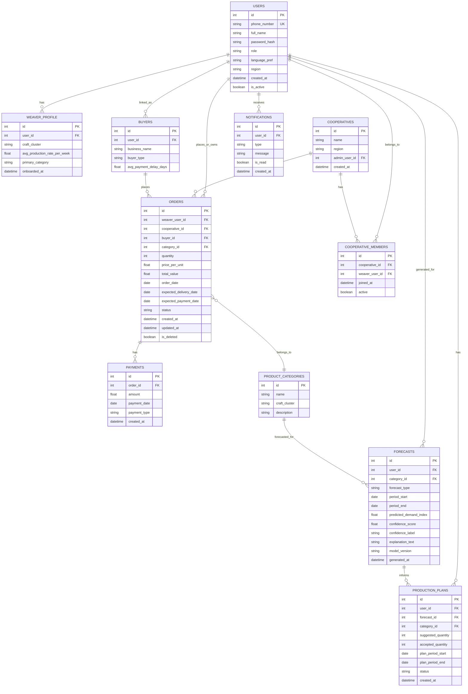

# SamvridhiTantu: Weaver Income Stability & Demand Forecasting Platform
### Software Requirement Specification & Architecture Document
**Handloom Hackathon 2026 — Theme 4.2: Income Stability & Demand Forecasting Tools**

---

## Table of Contents
1. Executive Summary
2. Problem Analysis
3. Target Users
4. Functional Requirements
5. Non-Functional Requirements
6. System Architecture
7. Database Design
8. API Design
9. Machine Learning Design
10. UI/UX Design
11. Complete Folder Structure
12. Security Design
13. Development Roadmap
14. Git Strategy
15. Testing Strategy
16. Future Enhancements
17. Judging Strategy

---

## 1. Executive Summary

**SamvridhiTantu** ("Prosperity Thread") is a full-stack, offline-friendly demand-forecasting and income-planning platform built for individual handloom weavers, weaver cooperatives, buyers, government officers, and NGOs.

The core idea: weavers rarely lack skill — they lack **visibility**. They don't know what will sell next month, when payments will actually land, whether they should weave sarees or stoles, or how much raw material to stock. SamvridhiTantu closes that visibility gap with three integrated capabilities:

1. **Demand Forecasting Engine** — a lightweight, explainable time-series model (SARIMAX/Holt-Winters via `statsmodels`, with a gradient-boosted regressor fallback via `scikit-learn`) that predicts demand for product categories over the next 1–3 months using historical order data, seasonal/festival calendars, and regional trend signals.
2. **Income & Production Planner** — converts forecasts into a concrete production plan (how many pieces of what, by when) and a cash-flow projection (expected income, expected payment delays, buffer recommendations).
3. **Order & Payment Tracker** — a lightweight CRM-like ledger so weavers/cooperatives can log orders, buyers, advances, and pending payments, which simultaneously becomes the training data for the forecasting engine — solving the classic hackathon "cold start, no data" problem by making data entry valuable in itself (not just a chore for the ML model).

A **Cooperative Aggregation Layer** lets a cooperative or NGO field officer view demand forecasts and income trends *across* many weavers, spot who is at risk of income shocks, and redistribute orders. A **Government/NGO Dashboard** aggregates anonymized, cooperative-level trends for scheme planning (e.g., where to route Mudra loans or raw material subsidies).

Everything is built with **100% free, open-source technology**: React + Vite frontend, FastAPI + SQLite backend, scikit-learn/statsmodels for ML, and a PWA (Progressive Web App) shell so the app installs on cheap Android phones and works with intermittent connectivity — critical since most weavers operate in low-bandwidth rural clusters (e.g., Varanasi, Chanderi, Pochampally, Kanchipuram belts).

The system is explicitly scoped in two tiers:
- **Build Tier** — fully working, demoable within a hackathon timeframe (see Roadmap, Section 13).
- **Vision Tier** — pitched via deck/mockups as the scaled national product, not live-coded.

---

## 2. Problem Analysis

### 2.1 Root Causes of Income Instability

| Root Cause | Description |
|---|---|
| **Seasonal demand blindness** | Weavers produce based on habit/instinct, not data. Festival and wedding season spikes (Diwali, Durga Puja, wedding season Oct–Feb) are known informally but not quantified per-weaver. |
| **Fragmented buyer relationships** | Orders come through informal, word-of-mouth, or middleman channels with no consolidated record — no way to see "which buyer pays late" or "which product sold best last Diwali." |
| **Delayed payments** | Master weavers/middlemen often delay payment 30–90 days post-delivery; weavers have no tool to forecast *cash-in-hand*, only *orders-in-hand*. |
| **No production planning** | Without demand signals, weavers either overproduce (dead stock, wasted yarn capital) or underproduce (missed sales windows). |
| **Information asymmetry with middlemen** | Middlemen aggregate market knowledge weavers don't have access to, extracting margin from that asymmetry. |
| **Generational disengagement** | Because income is unpredictable, youth see weaving as financially unviable compared to gig/urban work, threatening craft continuity. |

### 2.2 Current Issues With Existing Systems

- Government portals (e.g., **Handloom Census**, **e-Dhaga**, **Bunkar Mitra**, state-level e-marketing portals) are **informational/transactional**, not **predictive** — they don't forecast demand or income.
- E-commerce marketplaces (Amazon Karigar, Flipkart Samarth) give weavers a sales *channel* but not sales *intelligence* — no dashboards for individual artisans to understand demand trends.
- Cooperative societies maintain paper ledgers or basic Excel sheets — no forecasting, no aggregation across members.
- NGOs have qualitative field knowledge but no quantitative, scalable tooling to route support (loans, raw material, orders) to the weavers who need it most, when they need it.

### 2.3 Gaps in Current Systems

1. No tool converts **historical order data → forward-looking demand forecast** at the individual-weaver or cluster level.
2. No tool translates a demand forecast into **actionable production and cash-flow plans**.
3. No lightweight, **offline-capable** data entry system designed for low-literacy, low-connectivity users (most existing portals assume desktop/high-bandwidth government-office usage).
4. No **cooperative-level aggregation** that lets an NGO/officer see risk concentration (e.g., "12 weavers in this cluster all depend on one saree pattern with declining demand — diversify now").
5. No **explainability** — even where basic analytics exist, they are not presented in a way a weaver with limited formal/digital literacy can act on (numbers without recommendations).

---

## 3. Target Users

### 3.1 Individual Weaver ("Karigar")
**Profile:** May have low-to-moderate smartphone literacy, works from home/small workshop, often the primary or sole earner.
**Needs:**
- Simple, mostly-visual interface (icons, colors, minimal text entry, regional language support via `react-i18next`).
- "What should I weave next month?" answered in one glance.
- "When will I actually get paid?" cash-flow visibility.
- Works with poor/no internet (PWA offline mode, local caching, background sync).

### 3.2 Weaver Cooperative / Master Weaver (Society Admin)
**Profile:** Manages 10–200 weavers, allocates orders, tracks collective payments.
**Needs:**
- Aggregate dashboard: demand trends across all members, who is under-utilized, income disparity flags.
- Bulk order allocation tools.
- Export reports for society meetings / government reporting.

### 3.3 Buyer (Boutique, Exporter, E-commerce Aggregator, Individual Bulk Buyer)
**Profile:** Wants to place/track orders with reliable, quality-transparent weaver groups.
**Needs:**
- Browse cooperative/weaver catalogs with **demand-informed recommendations** ("Chanderi stoles are trending +18% this quarter").
- Place orders with clear timelines, track order status, view/rate past transactions.

### 3.4 Government Officer (Handloom Dept / DC Handlooms)
**Profile:** Oversees scheme disbursement (Mudra loans, raw material subsidy, weaver welfare schemes) across a district/state.
**Needs:**
- Aggregated, **anonymized** cluster-level dashboards — demand trend heatmaps by region/craft, income-risk clusters for scheme targeting.
- Exportable reports (PDF/CSV) for policy documentation.

### 3.5 NGO / Field Facilitator
**Profile:** Works directly with weaver clusters on ground, often the actual data-entry bridge for less digitally literate weavers.
**Needs:**
- Assisted data-entry mode (enter orders/income on behalf of a weaver).
- Early-warning income-risk alerts per weaver to prioritize field visits.
- Training/adoption tracking (who is actively using the tool).

### 3.6 System Admin
**Profile:** Hackathon/product maintainer.
**Needs:** User management, role assignment, system health, model retraining triggers, audit logs.

---

## 4. Functional Requirements

Each feature below is tagged **[BUILD]** (live demo scope) or **[VISION]** (pitch-deck only, described in Section 13/16).

### 4.1 Authentication & Onboarding **[BUILD]**
- FR-1.1: User registers with phone number + name + role (Weaver / Cooperative Admin / Buyer / Officer / NGO) + password.
  - *User story:* "As a weaver, I want to sign up with just my phone number and name so that I don't need an email or complex form."
- FR-1.2: JWT-based login/logout, password hashing via Passlib (bcrypt).
- FR-1.3: Role-based redirect to the correct dashboard after login.
- FR-1.4: Language selection (English / Hindi + one regional language demo, e.g., Telugu or Tamil) at onboarding, persisted per user.

### 4.2 Order & Income Ledger **[BUILD]**
- FR-2.1: Weaver/Cooperative can log a new order: product category, quantity, buyer (existing or new), price, order date, expected delivery date, expected payment date.
  - *User story:* "As a weaver, I want to log an order in under 30 seconds using dropdowns and number pads so that I don't need to type much."
- FR-2.2: Mark order status: Pending → In Production → Delivered → Paid / Partially Paid / Overdue.
- FR-2.3: View income summary: total earned (this month/quarter), pending payments, overdue payments flagged in red.
- FR-2.4: Edit/delete an order (with audit trail retained).
- FR-2.5: Quick-add "Advance Received" against an order.

### 4.3 Demand Forecasting Dashboard **[BUILD]**
- FR-3.1: System generates a **1–3 month forward demand forecast** per product category, based on the weaver's/cooperative's own historical order data plus a shared seasonal-index dataset (festival calendar, historical regional trend curve).
  - *User story:* "As a weaver, I want to see which products will likely be in demand next month so that I can plan what to weave."
- FR-3.2: Forecast displayed as a simple trend chart (Recharts) + a plain-language recommendation card ("Demand for cotton sarees is expected to rise ~20% in the next 6 weeks due to the wedding season — consider prioritizing this pattern").
- FR-3.3: Confidence indication (High/Medium/Low) shown in plain language, not just a numeric confidence interval — mapped from the model's prediction interval width.
- FR-3.4: Cold-start fallback: if a weaver has <3 months of order history, show **cluster-level/community forecast** (aggregated anonymized data from other weavers in the same craft cluster) instead of a blank state.

### 4.4 Production Planner **[BUILD]**
- FR-4.1: Based on the forecast, system suggests a production quantity per category for the upcoming period, factoring in the weaver's historical average production rate (pieces/week) entered once during onboarding.
- FR-4.2: Weaver can accept, adjust, or reject the suggested plan; adjustments are logged (used later to improve personalization).
- FR-4.3: Simple raw-material estimate (approximate yarn requirement) based on selected product type and quantity, using a static lookup table (not a paid API).

### 4.5 Cash-Flow Projection **[BUILD]**
- FR-5.1: Combine confirmed orders + forecasted new orders + historical payment-delay pattern (average days-to-payment per buyer) to project expected cash inflow over the next 4–12 weeks.
- FR-5.2: Visual cash-flow timeline (Recharts area/line chart) with a "lean period" warning if projected income drops below the user's historical average by a configurable threshold.
- FR-5.3: Suggest a savings buffer target for lean periods ("Based on your last lean season, consider setting aside ₹X over the next 6 weeks").

### 4.6 Cooperative Aggregation Dashboard **[BUILD]**
- FR-6.1: Cooperative admin sees a roster of member weavers with at-a-glance status: income trend (up/flat/down arrow), overdue payments, forecast alignment.
- FR-6.2: Aggregate demand forecast across all members' product categories, with a "diversification risk" flag if too many members depend on a single declining-demand category.
- FR-6.3: Bulk order allocation: admin distributes an incoming bulk order across available weavers based on capacity and current workload.

### 4.7 Buyer Portal **[BUILD - light version]**
- FR-7.1: Buyer browses cooperative/weaver product categories with a "trending" badge sourced from the forecasting engine.
- FR-7.2: Buyer places an order request, which appears in the relevant weaver's/cooperative's order ledger as "Pending Confirmation."
- FR-7.3: Buyer views order history and status.

### 4.8 Government/NGO Analytics Dashboard **[BUILD - light version, VISION for full scheme integration]**
- FR-8.1: **[BUILD]** Aggregated, anonymized view: demand trend by craft cluster/region, count of weavers at income risk (from cash-flow projections), exportable as CSV.
- FR-8.2: **[VISION]** Direct integration with scheme databases (Mudra, NHDC raw material subsidy) to auto-suggest scheme matches per at-risk cluster.

### 4.9 Notifications & Alerts **[BUILD - in-app only]**
- FR-9.1: In-app alert when a payment becomes overdue.
- FR-9.2: In-app alert when a new forecast is available or demand shifts significantly (>15% change) for the user's primary category.
- FR-9.3: **[VISION]** SMS/WhatsApp alerts (requires a paid gateway at scale — noted as a paid-API dependency to be added post-hackathon, explicitly excluded from BUILD tier per the free-tech constraint).

### 4.10 Offline Mode **[BUILD - core cases]**
- FR-10.1: Order entry works offline (cached via IndexedDB through the PWA service worker) and syncs to backend when connectivity returns.
- FR-10.2: Last-fetched forecast and dashboard data remain viewable offline (stale-while-revalidate caching).

### 4.11 Explainability Layer **[BUILD]**
- FR-11.1: Every forecast is accompanied by a 1–2 line plain-language "why" (e.g., "based on your last 3 Diwali seasons" or "based on regional cluster trend since you have limited history").
- FR-11.2: Model never shown as a black box number only — always paired with a recommendation and reason.

---

## 5. Non-Functional Requirements

| Category | Requirement |
|---|---|
| **Performance** | API responses < 500ms for CRUD operations on SQLite with expected hackathon-scale data (≤ 10k orders, ≤ 500 users). Forecast generation < 3s per request (precomputed/cached where possible, not synchronous heavy retraining on every request). |
| **Scalability** | Modular FastAPI routers + service layer so SQLite can be swapped for PostgreSQL later without touching business logic (SQLAlchemy ORM abstracts this). Stateless JWT auth allows horizontal scaling of the backend. |
| **Reliability** | Graceful degradation: if the ML service fails, dashboards still show raw historical data instead of crashing. All destructive actions (delete order) require confirmation and are soft-deleted (not hard-deleted) for audit/recovery. |
| **Security** | JWT auth with expiry + refresh flow, bcrypt password hashing, Pydantic input validation on every endpoint, parameterized queries via SQLAlchemy (SQL injection prevention), role-based access control (RBAC) middleware. |
| **Offline Capability** | PWA with service worker caching (Workbox via `vite-plugin-pwa`), IndexedDB local queue for offline writes, background sync API for reconciliation. |
| **Maintainability** | Clear separation: `routers/ → services/ → models/ → schemas/` in backend; `components/ → pages/ → hooks/ → services/` in frontend. Type-safe contracts via Pydantic (backend) and PropTypes/JSDoc or TS-lite conventions (frontend). |
| **Accessibility** | High-contrast, large-touch-target UI for low-digital-literacy users; iconography paired with text; multi-language via `react-i18next`; minimum WCAG AA color contrast; voice-friendly simple layouts (screen-reader-safe semantic HTML). |
| **Data Privacy** | Government/NGO dashboards only ever see aggregated/anonymized data — no individual weaver PII exposed at that role level, enforced at the API/service layer, not just the UI. |

---

## 6. System Architecture

### 6.1 High-Level Architecture (ASCII)

```
┌────────────────────────────────────────────────────────────────┐
│                         CLIENT LAYER (PWA)                       │
│  React + Vite + Tailwind + React Router + Recharts + i18next     │
│  Service Worker (vite-plugin-pwa) ── IndexedDB offline queue     │
└───────────────────────────┬───────────────────────────────────┘
                             │  HTTPS / REST (JSON) + JWT Bearer
┌───────────────────────────▼───────────────────────────────────┐
│                      BACKEND API LAYER                          │
│                     FastAPI + Pydantic                          │
│  ┌───────────────┐ ┌───────────────┐ ┌────────────────────┐   │
│  │ Auth Router    │ │ Orders Router │ │ Forecast Router      │  │
│  │ (JWT/Passlib)  │ │ (CRUD ledger) │ │ (calls ML service)   │  │
│  └───────────────┘ └───────────────┘ └────────────────────┘   │
│  ┌───────────────┐ ┌───────────────┐ ┌────────────────────┐   │
│  │ Coop Router    │ │ Buyer Router  │ │ Analytics Router     │  │
│  └───────────────┘ └───────────────┘ └────────────────────┘   │
│                     SERVICE LAYER (business logic)               │
└───────────────────────────┬───────────────────────────────────┘
                             │  SQLAlchemy ORM
┌───────────────────────────▼───────────────────────────────────┐
│                        SQLITE DATABASE                          │
│   users, orders, buyers, forecasts, production_plans, ...       │
└───────────────────────────┬───────────────────────────────────┘
                             │  Offline batch read (Pandas)
┌───────────────────────────▼───────────────────────────────────┐
│                    ML PIPELINE (offline/batch)                  │
│  Jupyter (EDA) → Pandas/NumPy (preprocess) →                    │
│  statsmodels (SARIMAX/Holt-Winters) + scikit-learn (GBR fallback)│
│  → joblib (serialize model) → forecasts table (cached results)  │
└────────────────────────────────────────────────────────────────┘
```

### 6.2 Frontend Architecture
- **React + Vite**: component-based SPA, fast dev/build cycle.
- **React Router**: role-based route guards (`/weaver/*`, `/coop/*`, `/buyer/*`, `/officer/*`, `/admin/*`).
- **Tailwind CSS**: utility-first styling, enables rapid consistent theming (also supports RTL/multi-language layout needs cleanly).
- **Recharts**: forecast trend lines, cash-flow area charts, cooperative aggregate bar charts.
- **react-i18next**: JSON translation bundles per language, loaded lazily.
- **vite-plugin-pwa**: generates service worker + manifest for installability and offline caching (Workbox strategies: `NetworkFirst` for API GETs, `CacheFirst` for static assets, custom background-sync queue for offline POST/PUT on orders).

### 6.3 Backend Architecture
- **FastAPI** app factory pattern, routers registered per domain (`auth`, `orders`, `forecast`, `cooperative`, `buyers`, `analytics`, `admin`).
- **Pydantic schemas** separate request/response models from SQLAlchemy ORM models (`schemas/` vs `models/`) — prevents leaking internal DB fields, enforces validation.
- **Service layer** (`services/`) holds business logic (e.g., cash-flow projection math, forecast-to-plan conversion) so routers stay thin (routing + auth only).
- **JWT Authentication**: `python-jose` or FastAPI's built-in OAuth2PasswordBearer flow; access token (short-lived, ~30 min) + refresh token (longer-lived, stored securely, rotated on use).
- **Dependency Injection**: FastAPI `Depends()` for DB session, current-user extraction, and role-checking guards reused across all protected routes.

### 6.4 ML Pipeline Architecture
- **Batch/offline-first design**: forecasts are **not** computed synchronously on every dashboard load. A scheduled/triggered job (simple APScheduler job or manual "Regenerate Forecast" button for the demo) runs the forecasting pipeline and writes results into a `forecasts` table, which the API simply reads. This avoids demo fragility (Section on Roadmap discusses this explicitly) — the live demo never depends on a model training successfully in real time in front of judges.
- **Two-tier model strategy**:
  1. **Individual model** (per weaver/category) when ≥3 months of order history exists — SARIMAX or Holt-Winters exponential smoothing via `statsmodels`.
  2. **Cluster/community fallback model** when history is insufficient — a `scikit-learn` GradientBoostingRegressor trained on pooled, anonymized cluster data with seasonal/festival features, used for cold-start users.
- **Model artifacts** serialized with `joblib`, versioned by filename (`model_<category>_<cluster>_<date>.pkl`), loaded by the Forecast Router at query time.

### 6.5 Data Flow (Order → Forecast → Plan → Cash-flow)

```
Weaver logs order ──► orders table
                         │
                         ▼
         (scheduled/manual trigger)
                         │
                         ▼
      ML pipeline reads historical orders + seasonal index
                         │
                         ▼
        forecast generated ──► forecasts table (cached)
                         │
                         ▼
  Forecast Router serves forecast ──► Frontend Dashboard (chart + recommendation)
                         │
                         ▼
   Production Planner service converts forecast → suggested plan
                         │
                         ▼
   Cash-flow service combines plan + orders + buyer payment-delay stats
                         │
                         ▼
        Cash-flow projection ──► Frontend (timeline chart + lean-period alert)
```

### 6.6 Internal Communication
All communication is synchronous REST/JSON over HTTPS between frontend and backend. The ML pipeline runs as an in-process/batch Python job within the same backend codebase (no separate microservice needed at hackathon scale) — reducing infra complexity and demo failure points. This can be split into a separate ML microservice in the Vision tier if the team scales post-hackathon.

---

## 7. Database Design

### 7.1 Entity-Relationship Diagram (Mermaid)



### 7.2 Table Notes

- **`users.role`**: enum-constrained string — `weaver`, `cooperative_admin`, `buyer`, `officer`, `ngo`, `admin`.
- **`orders.status`**: enum — `pending`, `confirmed`, `in_production`, `delivered`, `partially_paid`, `paid`, `overdue`, `cancelled`.
- **`orders.is_deleted`**: soft-delete flag; deletions never physically remove rows (audit trail + reliability requirement).
- **`forecasts.forecast_type`**: `individual` or `cluster_fallback`, indicating which of the two-tier models produced it.
- **`forecasts.confidence_label`**: derived from `confidence_score` bucketed into High/Medium/Low for plain-language display (FR-3.3).
- All foreign keys enforce `ON DELETE SET NULL` for optional relations (e.g., a cooperative being removed shouldn't cascade-delete historical orders) and `ON DELETE CASCADE` only for genuinely dependent child rows (e.g., `payments` under `orders`).
- Indexes recommended: `orders(weaver_user_id, order_date)`, `orders(category_id, order_date)`, `forecasts(user_id, category_id, period_start)` for fast dashboard queries.

---

## 8. API Design

Base URL: `/api/v1`. All protected endpoints require `Authorization: Bearer <jwt>`. All request/response bodies validated via Pydantic schemas. Standard error envelope:

```json
{ "error": true, "code": "VALIDATION_ERROR", "message": "quantity must be > 0", "details": {} }
```

### 8.1 Auth

| Endpoint | Method | Auth | Description |
|---|---|---|---|
| `/auth/register` | POST | None | Register new user. Body: `phone_number, full_name, password, role, language_pref`. 201 → user object (no password). 409 if phone exists. |
| `/auth/login` | POST | None | Body: `phone_number, password`. 200 → `{access_token, refresh_token, token_type, user}`. 401 on bad credentials. |
| `/auth/refresh` | POST | Refresh token | Body: `{refresh_token}`. 200 → new access token. 401 if expired/invalid. |
| `/auth/me` | GET | Bearer | Returns current user profile. |
| `/auth/logout` | POST | Bearer | Invalidates refresh token (server-side denylist or rotation record). |

### 8.2 Orders

| Endpoint | Method | Auth | Description |
|---|---|---|---|
| `/orders` | GET | Bearer | List orders for current user (weaver: own orders; coop admin: all member orders; buyer: own placed orders). Supports `?status=&category_id=&from=&to=` filters + pagination. |
| `/orders` | POST | Bearer (weaver/coop/buyer) | Create order. Validates `quantity > 0`, `price_per_unit > 0`, dates logically ordered. 201 → order object. |
| `/orders/{id}` | GET | Bearer | Get single order (RBAC: must own or manage it). 404 if not found/not owned. |
| `/orders/{id}` | PATCH | Bearer | Update fields (status, dates, quantity). 200 → updated order. 403 if not owner/manager. |
| `/orders/{id}` | DELETE | Bearer | Soft-delete. 204 on success. |
| `/orders/{id}/payments` | POST | Bearer | Log a payment against an order. Body: `amount, payment_date, payment_type`. Auto-updates order status to `paid`/`partially_paid`. |

### 8.3 Forecast

| Endpoint | Method | Auth | Description |
|---|---|---|---|
| `/forecast/me` | GET | Bearer (weaver) | Returns latest cached forecast(s) for the user's categories, with explanation text and confidence label. |
| `/forecast/regenerate` | POST | Bearer (weaver/admin) | Triggers the batch pipeline synchronously for demo purposes (small dataset → fast). Returns new forecast rows. Rate-limited to prevent spamming/demo abuse. |
| `/forecast/cluster/{cluster_name}` | GET | Bearer (any authenticated) | Returns the cluster/community fallback forecast (anonymized, used for cold-start weavers and for buyer "trending" badges). |

### 8.4 Production Plan

| Endpoint | Method | Auth | Description |
|---|---|---|---|
| `/plans` | GET | Bearer (weaver) | List production plans for current user. |
| `/plans/suggest` | POST | Bearer (weaver) | Generates a suggested plan from the latest forecast + user's production rate. Returns suggested quantity + raw material estimate. |
| `/plans/{id}` | PATCH | Bearer (weaver) | Accept/adjust a suggested plan (`accepted_quantity`, `status`). |

### 8.5 Cash-Flow

| Endpoint | Method | Auth | Description |
|---|---|---|---|
| `/cashflow/projection` | GET | Bearer (weaver) | Returns 4–12 week projected income timeline + lean-period flags + suggested buffer amount. |

### 8.6 Cooperative

| Endpoint | Method | Auth | Description |
|---|---|---|---|
| `/cooperatives/{id}/members` | GET | Bearer (coop admin) | Roster with income trend indicator per member. |
| `/cooperatives/{id}/aggregate-forecast` | GET | Bearer (coop admin) | Aggregated demand forecast + diversification risk flags across members. |
| `/cooperatives/{id}/allocate-order` | POST | Bearer (coop admin) | Distributes a bulk order across selected weaver members. |

### 8.7 Buyer

| Endpoint | Method | Auth | Description |
|---|---|---|---|
| `/buyers/catalog` | GET | Bearer (buyer) | Browse product categories with trending badges (sourced from cluster forecasts). |
| `/buyers/orders` | POST | Bearer (buyer) | Place an order request against a weaver/cooperative (creates `orders` row, status `pending`). |

### 8.8 Analytics (Officer/NGO)

| Endpoint | Method | Auth | Description |
|---|---|---|---|
| `/analytics/region-summary` | GET | Bearer (officer/ngo) | Anonymized, aggregated demand + income-risk summary by region/cluster. |
| `/analytics/export` | GET | Bearer (officer/ngo) | CSV export of the above for offline reporting. |

### 8.9 Error Handling Conventions
- `400` — validation error (Pydantic auto-generates field-level detail).
- `401` — missing/invalid/expired token.
- `403` — authenticated but not authorized for this resource/role (RBAC failure).
- `404` — resource not found or not owned by requester (deliberately not leaking existence of other users' resources).
- `409` — conflict (duplicate phone number on register).
- `422` — semantically invalid (e.g., delivery date before order date).
- `429` — rate limit on `/forecast/regenerate` and `/auth/login` (basic in-memory limiter for hackathon scope).
- `500` — unhandled server error, logged, generic message returned to client (no stack trace leakage).

---

## 9. Machine Learning Design

### 9.1 Data Collection
- **Primary source**: the app's own `orders` table — the ledger feature (Section 4.2) is deliberately the *first* thing built, because it is simultaneously (a) immediately useful to the weaver and (b) the training data source, solving cold-start honestly rather than pretending a public dataset fully substitutes for it.
- **Seasonal/festival calendar**: manually curated static dataset (CSV) of major Indian festivals/wedding-season windows by month/region — public knowledge, no paid API needed.
- **Public supplementary data** (optional, for cluster-level priors): Handloom Census 2019-20 summary statistics (publicly published by the Ministry of Textiles) used only to seed reasonable *initial* seasonal index weights for a cluster before enough live order data accumulates — not used as a live feed.

### 9.2 Data Preprocessing
- Aggregate raw orders into weekly/monthly time buckets per (weaver or cluster) × category.
- Handle missing periods (weeks with zero orders) via explicit zero-filling, not deletion — critical for time-series continuity.
- Normalize `total_value`/`quantity` by category to make demand comparable across product types with different price points (use quantity as the primary demand signal, value as secondary).
- Outlier handling: cap extreme single-order spikes (e.g., one unusually large bulk order) using a rolling median/IQR filter so one anomaly doesn't distort the seasonal pattern.

### 9.3 Feature Engineering
- Lag features: demand at t-1, t-4, t-12 (week-level) or t-1, t-3, t-12 (month-level).
- Rolling statistics: 4-week and 12-week rolling mean/std of demand.
- Seasonal/calendar features: month, is-festival-window flag, weeks-to-nearest-major-festival.
- Cluster-level features (for the fallback model only): cluster average demand, cluster weaver count, category popularity rank within cluster.

### 9.4 Model Selection & Justification

| Approach | Used For | Why |
|---|---|---|
| **Holt-Winters Exponential Smoothing** (`statsmodels.tsa.holtwinters`) | Individual weaver/category with ≥3 months history | Simple, interpretable, handles trend + seasonality explicitly, works well on short/sparse series typical of an individual artisan — exactly the hackathon-realistic data volume. No heavy tuning required, fast to fit, easy to explain to judges ("it learns your seasonal pattern"). |
| **SARIMAX** (`statsmodels.tsa.statespace.sarimax`) | Individual series with enough history (≥6 months) and available exogenous regressors (festival flag) | Allows adding the festival-window flag as an exogenous variable, improving forecast quality around known demand spikes — directly explainable to non-technical judges/users. |
| **GradientBoostingRegressor** (`scikit-learn`) | Cluster-level fallback / cold-start | Handles the pooled, richer feature set (multiple weavers' data, categorical cluster features) better than pure time-series models when data is cross-sectional rather than a single long series. Provides feature importances for explainability. |

**Recommendation for the hackathon prototype**: lead with **Holt-Winters** for the live demo (fast, deterministic, never fails to converge, trivially explainable on stage) and keep SARIMAX + GradientBoostingRegressor implemented and shown in the Jupyter notebook / pitch deck as the "production evolution path" — this directly addresses the demo-fragility risk of a more complex model failing unpredictably in front of judges.

### 9.5 Training Pipeline
1. Jupyter Notebook (`notebooks/eda.ipynb`) for exploratory analysis on seed/synthetic + any real pilot data.
2. `ml/pipeline/train.py` — scripted, repeatable version of the notebook logic: load from SQLite → preprocess → feature engineer → fit model per (user or cluster) × category → evaluate → serialize with `joblib`.
3. Triggered manually (`/forecast/regenerate`) or via a scheduled job (APScheduler, e.g., weekly) for the Vision tier.

### 9.6 Evaluation Metrics
- **MAPE (Mean Absolute Percentage Error)** — primary metric, intuitive to present to non-technical judges ("our forecast is off by ~12% on average").
- **RMSE** — secondary, for internal model comparison.
- **Backtesting**: walk-forward validation (train on months 1–N, test on N+1) rather than random train/test split, since this is time-series data — presented in the notebook to demonstrate rigor.

### 9.7 Forecast Generation
- Output: predicted demand index per category per future period (next 4/8/12 weeks), converted to a prediction interval → mapped to High/Medium/Low confidence label for the UI.
- Explanation text template-generated from the dominant feature driving the forecast (e.g., festival flag active → "wedding season demand pattern"; otherwise → "based on your typical trend over the last N months").

### 9.8 Model Retraining Strategy
- **Hackathon/BUILD tier**: manual retrain trigger via API, using all data available at that point — sufficient for a live demo narrative ("watch it update as I add this month's orders").
- **Vision tier**: scheduled weekly retraining job per active user/cluster once sufficient new order data has accumulated, with model versioning stored in `forecasts.model_version` for traceability and rollback.

---

## 10. UI/UX Design

Design principle across all screens: **icon + short text, large touch targets, color-coded status (green/amber/red), minimal typing, one primary action per screen.**

### 10.1 Screen: Login / Register
- **Purpose**: fast, low-friction entry for low-digital-literacy users.
- **Components**: phone number input (numeric keypad), name input, password, role selector (icon cards: Weaver / Cooperative / Buyer / Officer / NGO), language selector (flag/script icons).
- **Navigation**: → role-specific dashboard on success.
- **Inputs**: phone (10-digit validated), name, password (min 6 chars).
- **Outputs**: JWT stored securely (httpOnly-style handling via memory + refresh flow, not raw localStorage for the access token where avoidable).
- **Buttons**: "Register", "Login", "Forgot Password" (Vision tier — OTP-based reset, since SMS gateway is a paid dependency at hackathon scope; BUILD tier uses a simple security-question fallback).
- **Validation**: inline, real-time field validation with icon (✓/✗).
- **Empty/Error states**: "Phone number not registered — Register instead?" link; wrong password → generic "Invalid phone number or password" (no user enumeration).

### 10.2 Screen: Weaver Home Dashboard
- **Purpose**: single-glance answer to "How am I doing, and what should I do next?"
- **Components**: (1) Income summary card (this month earned / pending / overdue, color-coded), (2) Forecast highlight card (top trending category + plain-language recommendation), (3) Cash-flow mini-chart (Recharts sparkline) with lean-period badge if applicable, (4) Quick-action buttons: "Log New Order", "View Forecast", "View Plan".
- **Navigation**: bottom tab bar (Home / Orders / Forecast / Plan / Profile).
- **Empty state**: first-time user with no orders → onboarding card "Log your first order to start building your forecast" with a friendly illustration and a single CTA.
- **Error state**: if forecast unavailable, show cluster-level fallback with a note: "Showing trends for your region until we learn more about your orders."

### 10.3 Screen: Order Ledger (List + Add)
- **Purpose**: fast order logging and status tracking.
- **Components**: filterable list (status chips: Pending/In Production/Delivered/Paid/Overdue), floating "+ Add Order" button, each row shows category icon, buyer name, amount, status color dot.
- **Add Order Form**: category dropdown (with icons per product type), buyer (existing dropdown + "Add New Buyer" inline), quantity stepper, price per unit, auto-calculated total, order date (defaults to today), expected delivery date picker, expected payment date picker.
- **Validation**: quantity > 0, price > 0, delivery date ≥ order date, payment date ≥ order date.
- **Empty state**: "No orders yet — tap + to add your first order."
- **Error state**: inline red text under invalid field, submit button disabled until valid.

### 10.4 Screen: Forecast Detail
- **Purpose**: deeper dive into demand prediction per category.
- **Components**: category selector tabs, trend line chart (historical actual vs. forecasted, Recharts `LineChart` with a dashed forecast segment), confidence badge (High/Medium/Low with color), plain-language explanation paragraph, "Regenerate Forecast" button (rate-limited, shows loading state).
- **Empty state**: cold-start message + cluster fallback chart with a "based on your region" label clearly distinguishing it from personalized data.

### 10.5 Screen: Production Plan
- **Purpose**: turn forecast into an action plan.
- **Components**: suggested quantity per category (large number, editable stepper), raw material estimate card, "Accept Plan" / "Adjust" buttons, plan history list (past accepted plans vs. actual production, if tracked).
- **Validation**: adjusted quantity must be within a sane range (warns, doesn't block, if wildly different from suggestion — respects weaver's ground knowledge).

### 10.6 Screen: Cash-Flow Projection
- **Purpose**: visualize expected income over coming weeks.
- **Components**: area chart (Recharts) of projected income by week, lean-period shaded region with warning icon, suggested savings buffer card, list of upcoming expected payments (buyer, amount, expected date, days-overdue if applicable).
- **Empty state**: "Add orders with expected payment dates to see your cash-flow projection."

### 10.7 Screen: Cooperative Admin Dashboard
- **Purpose**: manage and monitor member weavers.
- **Components**: member roster table (name, income trend arrow, overdue count, last active), aggregate forecast chart across categories, diversification risk banner if applicable, "Allocate Bulk Order" wizard (select order → select eligible weavers by capacity → confirm split).
- **Navigation**: tabs for Roster / Forecast / Orders / Reports.

### 10.8 Screen: Buyer Catalog & Order
- **Purpose**: let buyers discover and order confidently.
- **Components**: category grid with photos (placeholder/static demo images), "Trending" badge on high-forecast categories, weaver/cooperative profile card, "Request Order" form (quantity, notes, desired delivery date).
- **Empty/Error states**: "No cooperatives available in this category yet."

### 10.9 Screen: Officer/NGO Analytics Dashboard
- **Purpose**: macro visibility for scheme targeting.
- **Components**: region/cluster selector, aggregated demand heat-map-style bar chart, income-risk cluster list (count of at-risk weavers, anonymized), "Export CSV" button.
- **Empty state**: "No data available for this region yet."

### 10.10 Screen: Profile / Settings
- **Purpose**: manage account, language, notification preferences.
- **Components**: editable name, language selector, logout button, (Weaver-only) production rate setting used by the planner.

---

## 11. Complete Folder Structure

```
handloom-hackathon-2026/
├── frontend/
│   ├── public/
│   │   ├── manifest.webmanifest
│   │   └── icons/
│   ├── src/
│   │   ├── assets/
│   │   ├── components/
│   │   │   ├── common/            (Button, Card, StatusBadge, Chart wrappers)
│   │   │   ├── orders/
│   │   │   ├── forecast/
│   │   │   ├── cashflow/
│   │   │   └── cooperative/
│   │   ├── pages/
│   │   │   ├── auth/
│   │   │   ├── weaver/
│   │   │   ├── cooperative/
│   │   │   ├── buyer/
│   │   │   ├── officer/
│   │   │   └── admin/
│   │   ├── hooks/                 (useAuth, useOfflineSync, useForecast)
│   │   ├── services/               (api.js, ordersApi.js, forecastApi.js)
│   │   ├── i18n/
│   │   │   └── locales/ (en.json, hi.json, te.json)
│   │   ├── store/                  (auth/session context or lightweight state)
│   │   ├── routes/                 (RoleProtectedRoute.jsx, router.jsx)
│   │   ├── utils/
│   │   ├── App.jsx
│   │   └── main.jsx
│   ├── index.html
│   ├── vite.config.js
│   ├── tailwind.config.js
│   └── package.json
│
├── backend/
│   ├── app/
│   │   ├── main.py
│   │   ├── core/
│   │   │   ├── config.py
│   │   │   ├── security.py         (JWT, password hashing)
│   │   │   └── dependencies.py     (get_db, get_current_user, role_guard)
│   │   ├── models/                 (SQLAlchemy ORM models)
│   │   ├── schemas/                (Pydantic request/response models)
│   │   ├── routers/
│   │   │   ├── auth.py
│   │   │   ├── orders.py
│   │   │   ├── forecast.py
│   │   │   ├── plans.py
│   │   │   ├── cashflow.py
│   │   │   ├── cooperatives.py
│   │   │   ├── buyers.py
│   │   │   └── analytics.py
│   │   ├── services/
│   │   │   ├── order_service.py
│   │   │   ├── forecast_service.py
│   │   │   ├── plan_service.py
│   │   │   ├── cashflow_service.py
│   │   │   └── analytics_service.py
│   │   └── db/
│   │       ├── base.py
│   │       └── session.py
│   ├── alembic/ (or simple init_db.py for hackathon scope)
│   ├── tests/
│   ├── requirements.txt
│   └── handloom.db  (SQLite file, gitignored in production, seeded for demo)
│
├── ml/
│   ├── notebooks/
│   │   └── eda_and_modeling.ipynb
│   ├── pipeline/
│   │   ├── preprocess.py
│   │   ├── features.py
│   │   ├── train.py
│   │   ├── evaluate.py
│   │   └── predict.py
│   ├── models/                     (serialized .pkl artifacts via joblib)
│   └── data/
│       ├── seasonal_calendar.csv
│       └── seed_orders.csv         (synthetic/pilot demo data)
│
├── docs/
│   ├── SRS_Architecture.md         (this document)
│   ├── api_reference.md
│   ├── er_diagram.png
│   └── pitch_deck/
│
├── assets/
│   └── figma_exports/
│
├── .env.example
├── .gitignore
└── README.md
```

---

## 12. Security Design

- **Authentication**: OAuth2-password-flow-style JWT via FastAPI. Access token short-lived (~30 min); refresh token longer-lived, rotated on each use, stored server-side in a `refresh_tokens` table to allow revocation (logout invalidates it).
- **Authorization (RBAC)**: `role_guard` dependency checks `current_user.role` against an allow-list per route (e.g., `/analytics/*` → `officer`, `ngo`, `admin` only). Resource-level checks additionally verify ownership (e.g., a weaver can only PATCH their own orders) — never rely on role alone for object-level access.
- **Password Hashing**: Passlib with bcrypt scheme, configurable work factor.
- **Input Validation**: every endpoint uses a Pydantic schema; no raw `dict` bodies accepted. Field constraints (`gt=0`, `max_length`, regex for phone numbers) enforced at the schema level, not just in the frontend.
- **SQL Injection Prevention**: exclusively SQLAlchemy ORM/Core parameterized queries — no raw string-formatted SQL anywhere in the codebase.
- **XSS Protection**: React's default JSX escaping handles output encoding; any place raw HTML injection might be needed (none expected) would require explicit sanitization (not used in this scope).
- **CSRF Considerations**: since auth uses a Bearer token in an `Authorization` header (not cookies) for API calls, classic CSRF risk is substantially reduced; if refresh tokens are ever stored in cookies, they are marked `HttpOnly`, `Secure`, `SameSite=Strict`.
- **Rate Limiting**: simple in-memory limiter (e.g., `slowapi`) on `/auth/login` (brute-force protection) and `/forecast/regenerate` (demo-abuse protection).
- **Data Minimization**: officer/NGO-facing endpoints only ever query pre-aggregated, anonymized views — enforced in the service layer so no accidental PII leak is possible even if a frontend bug requests too much.

---

## 13. Development Roadmap

The plan below assumes a **36-hour hackathon sprint** and is split into **Build Tier** (must be live and demoable) vs **Vision Tier** (deck/mockup only). This separation is the single most important risk-management decision in this document — a multi-model, multi-role system is easy to over-scope, and a partially-broken live demo loses more points than a polished narrower one.

| Phase | Goal | Deliverables | Est. Effort | Dependencies |
|---|---|---|---|---|
| **Phase 0 — Setup** | Repo, environments, base scaffolding | Vite+React skeleton, FastAPI skeleton, SQLite schema created, Figma wireframes for core 4 screens | 2–3 hrs | None |
| **Phase 1 — Auth & Ledger [BUILD]** | Working login/register + order CRUD | `/auth/*`, `/orders/*` endpoints; Login, Register, Order List/Add screens | 5–6 hrs | Phase 0 |
| **Phase 2 — Seed Data & ML Notebook [BUILD]** | Realistic synthetic demo dataset + working forecast model | `seed_orders.csv` (synthetic, seasonally patterned), `eda_and_modeling.ipynb`, Holt-Winters model validated with MAPE reported | 4–5 hrs | Phase 1 (schema finalized) |
| **Phase 3 — Forecast + Plan + Cash-flow API [BUILD]** | Wire ML pipeline into backend | `forecast_service.py`, `/forecast/*`, `/plans/*`, `/cashflow/*` endpoints returning cached, precomputed results (not live-training on request) | 5–6 hrs | Phase 2 |
| **Phase 4 — Weaver Dashboard UI [BUILD]** | Core demo screens fully wired | Home Dashboard, Forecast Detail, Production Plan, Cash-flow screens connected to real API | 5–6 hrs | Phase 3 |
| **Phase 5 — Cooperative + Buyer light [BUILD]** | Second-role demo narrative | Cooperative roster + aggregate forecast (can use precomputed aggregate for demo), Buyer catalog with trending badge | 4–5 hrs | Phase 4 |
| **Phase 6 — Offline PWA layer [BUILD]** | Offline order entry + caching | `vite-plugin-pwa` config, IndexedDB queue for offline order POSTs, sync-on-reconnect demo | 2–3 hrs | Phase 4 |
| **Phase 7 — Officer/NGO Analytics [BUILD - light]** | Third-role narrative for judging breadth | `/analytics/region-summary`, simple aggregate dashboard screen | 2 hrs | Phase 5 |
| **Phase 8 — Polish, i18n, Explainability copy [BUILD]** | Judge-facing quality pass | Hindi/regional language strings for at least the weaver flow, explanation text templates finalized, empty/error states polished | 3–4 hrs | Phases 1–7 |
| **Phase 9 — Pitch Deck & Vision Tier [VISION]** | Communicate scale-up story | Deck covering SMS/WhatsApp alerts, scheme integration, PostgreSQL migration path, multi-cluster national rollout, mockups only (Figma) | 2–3 hrs | Parallel, anytime |
| **Phase 10 — Demo Rehearsal & Bug Buffer** | De-risk live demo | Fixed demo script/data path, fallback screenshots in case of live failure, timing rehearsal | 2 hrs | All BUILD phases |

**Total estimated BUILD effort:** ~30–34 hours, appropriately leaving buffer within a 36-hour window. **Cut list if time runs short (in order of removal):** Phase 7 (Officer dashboard) → Phase 6 (offline PWA, degrade to "designed but not live") → Phase 5 buyer catalog → keep Phases 1–4 as the non-negotiable demo core (Auth → Ledger → Forecast → Plan → Cash-flow, single weaver role, fully live).

---

## 14. Git Strategy

**Branch Structure**
- `main` — always demo-ready/stable.
- `develop` — integration branch, merged into `main` only at milestone checkpoints (end of each Phase above).
- `feature/<short-name>` — e.g., `feature/order-ledger-api`, `feature/forecast-dashboard-ui`. Branched from `develop`, merged back via PR.
- `fix/<short-name>` — urgent bug fixes, can branch from `main` if a demo-blocking issue is found late and needs a fast-tracked merge.

**Commit Conventions** (Conventional Commits style):
```
feat(orders): add order creation endpoint with validation
fix(forecast): correct off-by-one week in Holt-Winters period index
docs(readme): add local setup instructions
chore(deps): add statsmodels to requirements.txt
refactor(auth): extract role_guard into reusable dependency
```

**Pull Request Workflow**
1. Branch from `develop`, keep PRs small and scoped to one feature/router/screen.
2. PR description includes: what changed, how it was tested, screenshot/GIF for UI changes.
3. At least one teammate reviews before merge (even in a hackathon, a 2-minute read-through catches integration breaks).
4. Merge to `develop` via squash-merge to keep history clean; merge `develop → main` only after a phase checkpoint passes a quick smoke test.

---

## 15. Testing Strategy

| Layer | Approach | Tooling |
|---|---|---|
| **Unit Testing (Backend)** | Test service-layer logic in isolation (cash-flow math, forecast-to-plan conversion, RBAC guard logic) with mocked DB sessions | `pytest` |
| **Unit Testing (ML)** | Validate preprocessing functions (zero-fill, outlier capping) and evaluate MAPE/RMSE on a held-out backtest window | `pytest`, notebook assertions |
| **API Testing** | Endpoint-level tests: auth flow, order CRUD, RBAC rejection cases (403s), validation error cases (422s) | `pytest` + FastAPI `TestClient`, manual collection in Bruno/Postman |
| **UI Testing** | Component rendering smoke tests for critical components (OrderForm, ForecastChart) | Manual test pass prioritized for hackathon timeframe; React Testing Library if time allows |
| **Integration Testing** | End-to-end flow: register → login → add order → regenerate forecast → view plan → view cash-flow, run against a seeded SQLite test DB | `pytest` scripted flow or manual scripted walkthrough |
| **Manual Testing** | Full demo-script walkthrough on an actual low-end Android device over throttled/offline network, in at least one non-English language | Team dry-run before submission, using Chrome DevTools network throttling + PWA offline toggle |

---

## 16. Future Enhancements (Post-Hackathon Vision)

- SMS/WhatsApp payment and forecast alerts (requires a paid gateway such as Twilio/Gupshup — explicitly deferred due to the free-tech constraint).
- Direct integration with government scheme databases (Mudra loan matching, NHDC raw material subsidy auto-suggestion) for the Officer role.
- Migration from SQLite to PostgreSQL for multi-cluster national scale, with the existing SQLAlchemy ORM layer requiring minimal code change.
- Computer-vision based quality/pattern recognition (leveraging existing CV/TFLite experience) to auto-tag product photos by category, reducing manual data entry further.
- Voice-based order entry in regional languages for very low-literacy users.
- Marketplace payment escrow integration to directly address payment-delay root cause (would require a licensed payment gateway partner).
- Federated/cross-cooperative demand pooling to give even small individual weavers cluster-level forecasting confidence sooner.

---

## 17. Judging Strategy — Feature-to-Criteria Alignment

| Judging Criterion | How This Solution Delivers |
|---|---|
| **Innovation** | Converts a purely transactional order-ledger habit into the actual training data for a personalized forecasting model — solving the "no data for ML" cold-start problem by design, not by assumption. Two-tier individual/cluster model is a genuinely novel-for-this-space approach to sparse artisan data. |
| **Practicality** | Every BUILD-tier feature maps directly to a root cause identified in Section 2 (irregular income → cash-flow projection; seasonal blindness → forecast; no data → ledger). No feature exists just to showcase AI. |
| **Technical Implementation** | Full-stack, modular, RBAC-secured, offline-capable PWA with an explainable, backtested ML pipeline — demonstrated live, not just described. |
| **User Impact** | Directly targets the stated hackathon goal (income stability, demand forecasting) for the least digitally-empowered stakeholder (individual weaver) while also serving cooperatives, buyers, and government for ecosystem-wide impact. |
| **Scalability** | SQLite → PostgreSQL migration path via SQLAlchemy abstraction; stateless JWT auth; modular ML pipeline that scales from individual to cluster to (future) national aggregation. |
| **Sustainability** | 100% free/open-source stack means zero recurring cost barrier for weaver cooperatives or NGOs to actually adopt and keep running post-hackathon. |
| **Presentation** | Clear Build-vs-Vision separation lets the team present a confident, fully-working narrow demo while still articulating an ambitious, credible scale-up story in the pitch deck — avoiding the common failure mode of an overscoped, half-broken live demo. |

---

*End of Software Requirement Specification & Architecture Document. This document is ready for team review and Phase 0 kickoff. No implementation code has been included, per instructions — this is the finalized planning and architecture blueprint.*
