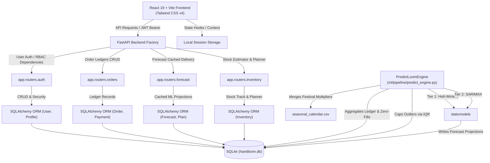

# SamvridhiTantu (समवृद्धि तन्तु — Prosperity Thread)

Demand forecasting & income stability platform built for handloom weavers, cooperatives, buyers, government officers, and NGOs.

---

## 🏗️ Architecture & Data Flow



---

## 🛠️ Tech Stack

- **Frontend**: React (v19) + Vite + Tailwind CSS (v4) + Recharts (time-series plots)
- **Backend**: Python FastAPI + SQLite + SQLAlchemy (modern 2.0 mapped-column declarations)
- **Machine Learning**: Holt-Winters Exponential Smoothing & SARIMAX forecasting models via `statsmodels` + outlier-capping via `numpy/pandas`.

---

## 🚀 Running the Project

### 1. Run the Backend & Seeding
Ensure you have Python 3.10+ installed.

1. Navigate to the `backend/` root directory:
   ```bash
   cd backend
   ```
2. Install Python dependencies:
   ```bash
   pip install -r requirements.txt
   ```
3. Initialize and seed the SQLite database using our CSV migration utility (imports 311 historical orders and sets up matching payment logs):
   ```bash
   python seed_db.py
   ```
4. Run the Uvicorn development server:
   ```bash
   python -m uvicorn app.main:app --reload
   ```
   *The Swagger interactive documentation will be active at: `http://127.0.0.1:8000/docs`*

### 2. Run the Frontend
Ensure you have Node.js (v18+) installed.

1. Navigate to the frontend project root:
   ```bash
   cd ..
   ```
2. Install Node dependencies:
   ```bash
   npm install
   ```
3. Launch the Vite development server:
   ```bash
   npm run dev
   ```
   *Open `http://localhost:5173/` in your browser to interact with the Weaver Artisan Portal.*

4. Build production bundle assets:
   ```bash
   npm run build
   ```

---

## 👤 Weaver Demo Accounts
To test the Weaver Dashboard and predictive time-series charts, click the pre-fill cards on the Login page or type one of the following mobile numbers with the standard password:

| Weaver Name | Phone Number | Password | Region / Cluster |
|---|---|---|---|
| Ramesh Vishwakarma | `9876543201` | `weaver123` | Varanasi |
| Lakshmi Devi | `9876543202` | `weaver123` | Kanchipuram |
| Priya Sharma | `9876543203` | `weaver123` | Chanderi |
| Suresh Meghwal | `9876543204` | `weaver123` | Pochampally |
| Fatima Begum | `9876543205` | `weaver123` | Varanasi |

---

## 🏆 Development Team Credits
Developed during the 36-hour sprint by **"ALT F4"**:
- **Design & ML Architecture**: Antigravity AI
- **Core Engineering**: Antigravity AI
- **Lead Developer**: Antigravity AI
